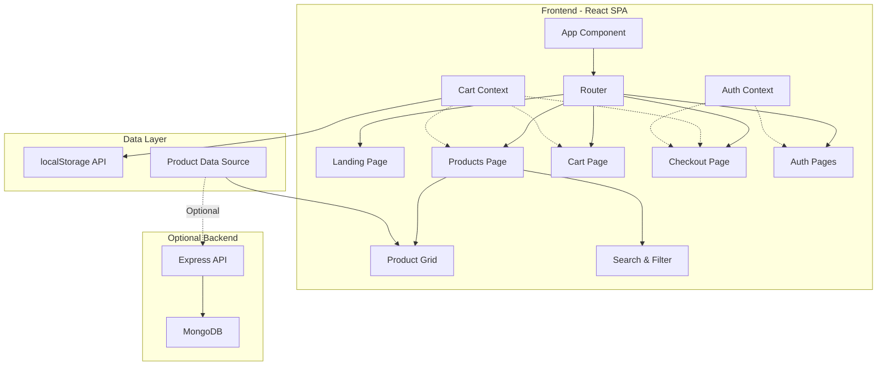
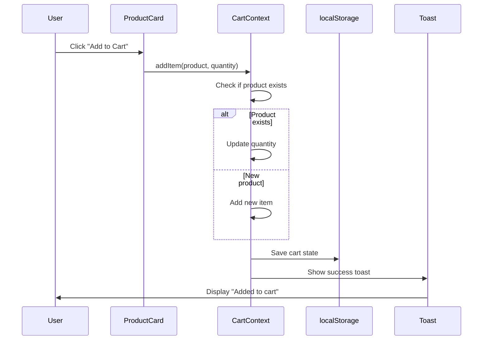
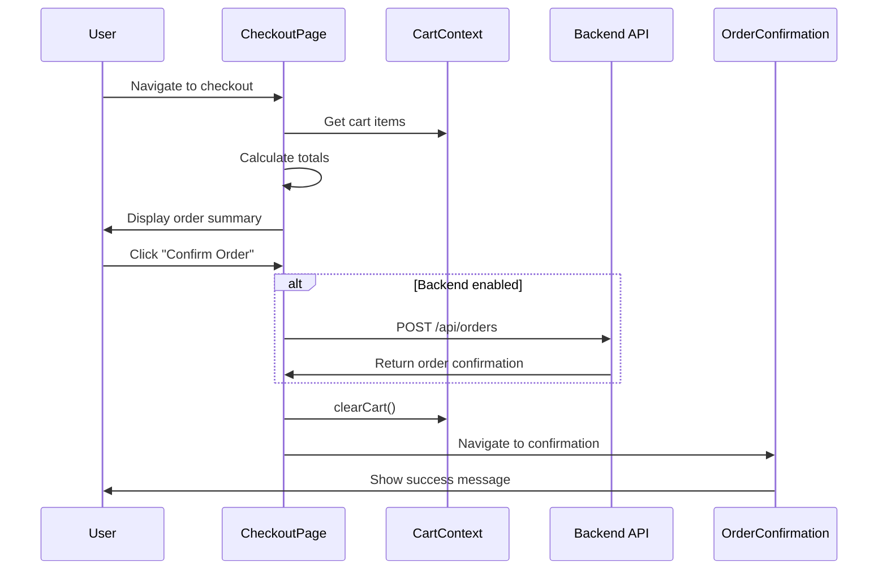

# Design Document

## Overview

Hami MiniMarket is a React-based single-page application (SPA) that provides a complete e-commerce experience for fruits and vegetables. The application follows a modular architecture with reusable components, centralized state management, and persistent storage. The design prioritizes mobile-first responsive layouts, accessibility, and clean separation of concerns.

## Architecture

### High-Level Architecture



### Technology Stack

**Core:**
- React 18+ (with hooks and context)
- React Router v6 (for SPA routing)
- CSS Modules or Tailwind CSS (for styling)
- Vite (build tool and dev server)

**Optional Backend:**
- Node.js with Express
- MongoDB with Mongoose
- JWT for authentication
- bcrypt for password hashing

### Folder Structure

```
hami-minimarket/
├── public/
│   ├── images/
│   │   ├── logo.svg
│   │   └── products/
│   └── favicon.ico
├── src/
│   ├── components/
│   │   ├── common/
│   │   │   ├── Navbar.jsx
│   │   │   ├── Footer.jsx
│   │   │   ├── Button.jsx
│   │   │   └── Toast.jsx
│   │   ├── products/
│   │   │   ├── ProductCard.jsx
│   │   │   ├── ProductGrid.jsx
│   │   │   ├── SearchBar.jsx
│   │   │   └── CategoryFilter.jsx
│   │   ├── cart/
│   │   │   ├── CartSidebar.jsx
│   │   │   ├── CartItem.jsx
│   │   │   └── CartCounter.jsx
│   │   └── checkout/
│   │       ├── OrderSummary.jsx
│   │       └── OrderConfirmation.jsx
│   ├── pages/
│   │   ├── LandingPage.jsx
│   │   ├── ProductsPage.jsx
│   │   ├── CartPage.jsx
│   │   ├── CheckoutPage.jsx
│   │   ├── LoginPage.jsx
│   │   └── SignupPage.jsx
│   ├── context/
│   │   ├── CartContext.jsx
│   │   └── AuthContext.jsx
│   ├── hooks/
│   │   ├── useCart.js
│   │   ├── useLocalStorage.js
│   │   └── useAuth.js
│   ├── utils/
│   │   ├── storage.js
│   │   ├── calculations.js
│   │   └── api.js
│   ├── data/
│   │   └── products.json
│   ├── App.jsx
│   ├── main.jsx
│   └── index.css
├── backend/ (optional)
│   ├── models/
│   │   ├── Product.js
│   │   ├── Order.js
│   │   └── User.js
│   ├── routes/
│   │   ├── products.js
│   │   ├── orders.js
│   │   └── auth.js
│   ├── middleware/
│   │   └── auth.js
│   ├── config/
│   │   └── db.js
│   └── server.js
├── data/
│   └── products.json
├── package.json
└── README.md
```

## Components and Interfaces

### Core Components

#### 1. App Component
**Purpose:** Root component managing routing and global providers

**Props:** None

**State:** None (delegates to contexts)

**Key Features:**
- Wraps application with CartContext and AuthContext providers
- Configures React Router with all application routes
- Renders Navbar and Footer on all pages

#### 2. Navbar Component
**Purpose:** Global navigation with cart counter and auth status

**Props:** None (consumes context)

**Key Features:**
- Logo and brand name
- Navigation links (Home, Products, Cart)
- Cart counter badge showing total items
- Login/Signup or User menu (if auth enabled)
- Mobile hamburger menu for responsive design

#### 3. ProductCard Component
**Purpose:** Display individual product with add-to-cart action

**Props:**
```typescript
interface ProductCardProps {
  product: {
    id: string;
    name: string;
    category: string;
    price: number;
    image: string;
    stock?: number;
  };
}
```

**Key Features:**
- Product image with fallback
- Product name, category, and price
- "Add to Cart" button
- Optional: Low stock badge if stock < 10
- Optional: Quantity selector

#### 4. ProductGrid Component
**Purpose:** Render filtered and searched products in responsive grid

**Props:**
```typescript
interface ProductGridProps {
  products: Product[];
  searchQuery: string;
  selectedCategory: string;
}
```

**Key Features:**
- CSS Grid layout (1 column mobile, 2-3 tablet, 4 desktop)
- Filters products based on search and category
- Empty state when no products match filters
- Loading state while fetching data

#### 5. SearchBar Component
**Purpose:** Text input for product name search

**Props:**
```typescript
interface SearchBarProps {
  value: string;
  onChange: (value: string) => void;
}
```

**Key Features:**
- Debounced input to avoid excessive filtering
- Clear button when text is present
- Search icon
- Accessible label

#### 6. CategoryFilter Component
**Purpose:** Filter products by category

**Props:**
```typescript
interface CategoryFilterProps {
  categories: string[];
  selected: string;
  onChange: (category: string) => void;
}
```

**Key Features:**
- "All" option to show all products
- Button or dropdown for category selection
- Active state styling for selected category

#### 7. CartSidebar Component
**Purpose:** Slide-out panel showing cart contents

**Props:**
```typescript
interface CartSidebarProps {
  isOpen: boolean;
  onClose: () => void;
}
```

**Key Features:**
- Overlay backdrop
- Slide animation from right
- List of CartItem components
- Subtotal display
- "Proceed to Checkout" button
- Close button

#### 8. CartItem Component
**Purpose:** Display cart item with quantity controls

**Props:**
```typescript
interface CartItemProps {
  item: {
    product: Product;
    quantity: number;
  };
  onUpdateQuantity: (productId: string, quantity: number) => void;
  onRemove: (productId: string) => void;
}
```

**Key Features:**
- Product thumbnail and name
- Price per unit and line total
- Quantity increment/decrement buttons
- Remove button
- Disabled state when quantity is at limits

#### 9. OrderSummary Component
**Purpose:** Display checkout totals and line items

**Props:**
```typescript
interface OrderSummaryProps {
  items: CartItem[];
  subtotal: number;
  tax: number;
  discount: number;
  total: number;
}
```

**Key Features:**
- List of items with quantities and prices
- Subtotal row
- Tax row (e.g., 8% of subtotal)
- Discount row (if applicable, e.g., 10% off orders > $50)
- Bold total row
- Clear visual hierarchy

#### 10. OrderConfirmation Component
**Purpose:** Success message after order placement

**Props:**
```typescript
interface OrderConfirmationProps {
  orderNumber: string;
  total: number;
}
```

**Key Features:**
- Success icon/animation
- Order number
- Total amount
- "Continue Shopping" button
- Clears cart on mount

### Context Providers

#### CartContext
**Purpose:** Global cart state management

**State:**
```typescript
interface CartState {
  items: CartItem[];
  addItem: (product: Product, quantity?: number) => void;
  updateQuantity: (productId: string, quantity: number) => void;
  removeItem: (productId: string) => void;
  clearCart: () => void;
  getItemCount: () => number;
  getSubtotal: () => number;
}
```

**Key Features:**
- Syncs with localStorage on every state change
- Loads initial state from localStorage
- Provides helper methods for calculations
- Prevents duplicate products (updates quantity instead)

#### AuthContext (Optional)
**Purpose:** User authentication state

**State:**
```typescript
interface AuthState {
  user: User | null;
  isAuthenticated: boolean;
  login: (email: string, password: string) => Promise<void>;
  signup: (email: string, password: string, name: string) => Promise<void>;
  logout: () => void;
}
```

**Key Features:**
- Stores JWT token in localStorage
- Validates token on app load
- Provides protected route wrapper
- Handles API authentication headers

## Data Models

### Product Model

```typescript
interface Product {
  id: string;
  name: string;
  category: 'fruits' | 'vegetables';
  price: number; // in dollars
  image: string; // URL or path
  description?: string;
  stock?: number; // optional for stock tracking
  unit?: string; // e.g., "lb", "each"
}
```

**Sample products.json:**
```json
[
  {
    "id": "p001",
    "name": "Organic Apples",
    "category": "fruits",
    "price": 3.99,
    "image": "/images/products/apples.jpg",
    "description": "Fresh organic apples",
    "stock": 50,
    "unit": "lb"
  },
  {
    "id": "p002",
    "name": "Carrots",
    "category": "vegetables",
    "price": 2.49,
    "image": "/images/products/carrots.jpg",
    "description": "Crunchy orange carrots",
    "stock": 8,
    "unit": "lb"
  }
]
```

### Cart Item Model

```typescript
interface CartItem {
  product: Product;
  quantity: number;
}
```

### Order Model (Backend)

```typescript
interface Order {
  id: string;
  userId?: string; // if auth enabled
  items: {
    productId: string;
    name: string;
    price: number;
    quantity: number;
  }[];
  subtotal: number;
  tax: number;
  discount: number;
  total: number;
  status: 'pending' | 'confirmed' | 'completed';
  createdAt: Date;
}
```

### User Model (Backend - Optional)

```typescript
interface User {
  id: string;
  name: string;
  email: string;
  password: string; // hashed
  createdAt: Date;
}
```

## Data Flow

### Adding Product to Cart



### Checkout Flow



## Styling and Theming

### Design System

**Color Palette:**
- Primary: `#4CAF50` (Green - fresh produce theme)
- Secondary: `#FF9800` (Orange - accent)
- Background: `#FFFFFF`
- Surface: `#F5F5F5`
- Text Primary: `#212121`
- Text Secondary: `#757575`
- Error: `#F44336`
- Success: `#4CAF50`

**Typography:**
- Font Family: 'Inter', 'Segoe UI', sans-serif
- Headings: 600-700 weight
- Body: 400 weight
- Base Size: 16px
- Scale: 1.25 (modular scale)

**Spacing:**
- Base unit: 8px
- Scale: 8px, 16px, 24px, 32px, 48px, 64px

**Breakpoints:**
- Mobile: < 640px
- Tablet: 640px - 1024px
- Desktop: > 1024px

### Responsive Grid

**Product Grid:**
- Mobile: 1 column
- Tablet: 2 columns
- Desktop: 3-4 columns
- Gap: 24px

## Error Handling

### Frontend Error Scenarios

1. **Product Data Loading Failure**
   - Display error message with retry button
   - Fallback to empty state with helpful message
   - Log error to console for debugging

2. **localStorage Unavailable**
   - Detect localStorage support on app load
   - Show warning banner if unavailable
   - Gracefully degrade to session-only cart

3. **Invalid Cart Data**
   - Validate cart structure on load
   - Clear corrupted data and start fresh
   - Notify user of cart reset

4. **Network Errors (Backend)**
   - Show toast notification with error message
   - Provide retry mechanism
   - Cache last successful data when possible

5. **Authentication Errors**
   - Display inline form validation errors
   - Show clear error messages for login failures
   - Redirect to login on token expiration

### Error Handling Utilities

```typescript
// utils/errorHandler.js
export const handleApiError = (error) => {
  if (error.response) {
    // Server responded with error status
    return error.response.data.message || 'Server error occurred';
  } else if (error.request) {
    // Request made but no response
    return 'Network error. Please check your connection.';
  } else {
    // Something else happened
    return 'An unexpected error occurred';
  }
};

export const validateCartData = (cartData) => {
  if (!Array.isArray(cartData)) return false;
  return cartData.every(item => 
    item.product && 
    item.product.id && 
    typeof item.quantity === 'number' &&
    item.quantity > 0
  );
};
```

## Testing Strategy

### Unit Testing

**Tools:** Vitest + React Testing Library

**Components to Test:**
- ProductCard: rendering, add to cart action
- CartItem: quantity updates, remove action
- SearchBar: input handling, debouncing
- CategoryFilter: selection changes
- OrderSummary: calculation accuracy

**Utilities to Test:**
- storage.js: localStorage operations
- calculations.js: subtotal, tax, discount, total
- api.js: request formatting, error handling

**Example Test:**
```javascript
// ProductCard.test.jsx
describe('ProductCard', () => {
  it('should call addItem when Add to Cart is clicked', () => {
    const mockAddItem = vi.fn();
    const product = { id: '1', name: 'Apple', price: 3.99 };
    
    render(
      <CartContext.Provider value={{ addItem: mockAddItem }}>
        <ProductCard product={product} />
      </CartContext.Provider>
    );
    
    fireEvent.click(screen.getByText('Add to Cart'));
    expect(mockAddItem).toHaveBeenCalledWith(product, 1);
  });
});
```

### Integration Testing

**Scenarios:**
- Complete shopping flow: browse → add to cart → checkout → confirm
- Cart persistence: add items → refresh page → verify cart restored
- Search and filter: apply filters → verify correct products shown
- Authentication flow: signup → login → checkout (if auth enabled)

### Manual Testing Checklist

- [ ] Responsive layout on mobile, tablet, desktop
- [ ] Keyboard navigation works for all interactive elements
- [ ] Screen reader announces cart updates
- [ ] Images have alt text
- [ ] Forms have proper labels
- [ ] Color contrast meets WCAG AA standards
- [ ] Cart persists across page refreshes
- [ ] Checkout calculations are accurate
- [ ] Order confirmation clears cart

## Accessibility Considerations

### WCAG 2.1 AA Compliance

1. **Semantic HTML**
   - Use proper heading hierarchy (h1 → h2 → h3)
   - Use `<button>` for actions, `<a>` for navigation
   - Use `<nav>`, `<main>`, `<footer>` landmarks

2. **Keyboard Navigation**
   - All interactive elements focusable
   - Visible focus indicators
   - Logical tab order
   - Escape key closes modals/sidebars

3. **Screen Reader Support**
   - ARIA labels for icon buttons
   - ARIA live regions for cart updates
   - Alt text for all images
   - Form labels properly associated

4. **Visual Design**
   - Minimum 4.5:1 contrast for text
   - Minimum 3:1 contrast for UI components
   - Text resizable to 200% without loss of functionality
   - No information conveyed by color alone

5. **Forms**
   - Clear error messages
   - Error prevention (validation)
   - Labels and instructions
   - Success confirmation

### Accessibility Code Examples

```jsx
// Accessible button with icon
<button 
  onClick={handleAddToCart}
  aria-label={`Add ${product.name} to cart`}
>
  <ShoppingCartIcon aria-hidden="true" />
  Add to Cart
</button>

// Cart counter with screen reader announcement
<div aria-live="polite" aria-atomic="true">
  <span className="cart-counter">{itemCount}</span>
  <span className="sr-only">{itemCount} items in cart</span>
</div>

// Accessible form input
<div className="form-group">
  <label htmlFor="email">Email Address</label>
  <input
    id="email"
    type="email"
    aria-required="true"
    aria-invalid={errors.email ? 'true' : 'false'}
    aria-describedby={errors.email ? 'email-error' : undefined}
  />
  {errors.email && (
    <span id="email-error" className="error" role="alert">
      {errors.email}
    </span>
  )}
</div>
```

## Performance Optimization

### Frontend Optimizations

1. **Code Splitting**
   - Lazy load route components
   - Separate vendor bundles
   - Dynamic imports for heavy components

2. **Image Optimization**
   - Use WebP format with fallbacks
   - Implement lazy loading for product images
   - Provide multiple sizes for responsive images
   - Compress images to < 100KB

3. **Caching Strategy**
   - Cache product data in memory
   - Use React.memo for expensive components
   - Debounce search input
   - Throttle scroll events

4. **Bundle Size**
   - Tree-shake unused code
   - Minimize dependencies
   - Use production builds
   - Enable gzip compression

### Backend Optimizations (Optional)

1. **Database Indexing**
   - Index product IDs and categories
   - Index user emails for auth lookups

2. **API Response Caching**
   - Cache product list responses
   - Set appropriate cache headers

3. **Query Optimization**
   - Select only needed fields
   - Limit response sizes
   - Implement pagination for large datasets

## Deployment Considerations

### Frontend Deployment

**Recommended Platforms:**
- Vercel (optimal for Vite/React)
- Netlify
- GitHub Pages

**Build Configuration:**
```json
{
  "scripts": {
    "build": "vite build",
    "preview": "vite preview"
  }
}
```

**Environment Variables:**
```
VITE_API_URL=https://api.hami-minimarket.com
VITE_ENABLE_AUTH=true
```

### Backend Deployment (Optional)

**Recommended Platforms:**
- Render
- Railway
- Heroku
- DigitalOcean App Platform

**Environment Variables:**
```
MONGODB_URI=mongodb+srv://...
JWT_SECRET=your-secret-key
PORT=5000
NODE_ENV=production
```

## Security Considerations

### Frontend Security

1. **Input Validation**
   - Sanitize user inputs
   - Validate email formats
   - Prevent XSS attacks

2. **localStorage Security**
   - Don't store sensitive data
   - Validate data on retrieval
   - Clear on logout

### Backend Security (Optional)

1. **Authentication**
   - Hash passwords with bcrypt (10+ rounds)
   - Use JWT with expiration
   - Implement refresh tokens
   - Rate limit login attempts

2. **API Security**
   - Validate all inputs
   - Use CORS properly
   - Implement rate limiting
   - Sanitize database queries
   - Use HTTPS only

3. **Environment Variables**
   - Never commit secrets
   - Use .env files
   - Rotate keys regularly

## Future Enhancements

Potential features for future iterations:

1. **User Features**
   - Order history and tracking
   - Wishlist functionality
   - Product reviews and ratings
   - User profile management

2. **Shopping Features**
   - Promo code system
   - Multiple payment methods
   - Shipping address management
   - Email order confirmations

3. **Admin Features**
   - Product management dashboard
   - Order management
   - Inventory tracking
   - Analytics and reporting

4. **Technical Improvements**
   - Progressive Web App (PWA)
   - Offline support
   - Push notifications
   - Advanced search with Algolia
   - Real-time stock updates with WebSockets
